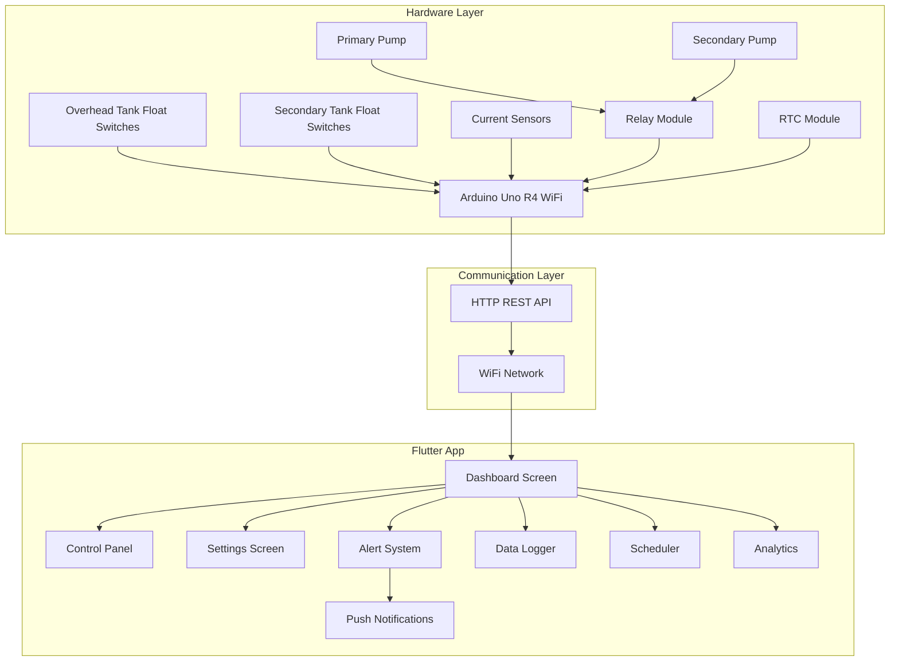

# Water Level Automation System - Enhanced Architecture

## System Overview

This document outlines the comprehensive architecture for a dual-pump water level automation system with Arduino Uno R4 WiFi and Flutter mobile app integration.

## System Architecture



## Hardware Components

### Tank Monitoring
- **Overhead Tank**: 5 float switches (Empty, Low, Medium, High, Full)
- **Secondary Tank**: 5 float switches (Empty, Low, Medium, High, Full)
- **Level Detection**: Discrete level monitoring with visual indicators

### Pump System
- **Primary Pump**: Main water pump with current monitoring
- **Secondary Pump**: Backup pump with automatic failover
- **Current Sensors**: ACS712 or similar for power consumption monitoring
- **Relay Control**: 2-channel relay module for pump switching

### Additional Sensors
- **RTC Module**: Real-time clock for scheduling functionality
- **WiFi Module**: Built-in Arduino R4 WiFi capability

## Flutter App Features

### 1. Enhanced Dashboard
- Real-time tank level indicators with discrete level display
- Pump status with current consumption readings
- System mode indicators (Auto/Manual/Scheduled)
- Active alerts and notifications panel
- Quick action buttons for emergency controls

### 2. Advanced Pump Control
- **Manual Override**: Direct pump control with safety interlocks
- **Automatic Mode**: Level-based pump operation
- **Scheduled Mode**: Time-based pump operation
- **Smart Switching**: Automatic primary/secondary failover
- **Runtime Limits**: Maximum operation time protection

### 3. Scheduling System
- **Daily Schedules**: Set specific times for pump operation
- **Weekly Patterns**: Different schedules for different days
- **Seasonal Adjustments**: Modify schedules based on usage patterns
- **Holiday Mode**: Special scheduling for extended absences
- **Smart Scheduling**: AI-based optimization based on usage patterns

### 4. Maintenance & Analytics
- **Pump Runtime Tracking**: Monitor total operating hours
- **Maintenance Alerts**: Scheduled maintenance reminders
- **Water Usage Analytics**: Daily/weekly/monthly consumption
- **Efficiency Monitoring**: Power consumption analysis
- **Performance Trends**: Historical data visualization

### 5. Alert & Notification System
- **Push Notifications**: Remote alerts for critical conditions
- **Alert Categories**: 
  - Critical (Tank empty, pump failure)
  - Warning (Low levels, high consumption)
  - Info (Scheduled operations, maintenance due)
- **Alert History**: Log of all system alerts
- **Acknowledgment System**: Mark alerts as resolved

## Arduino REST API Endpoints

### Status & Monitoring
- `GET /status` - Complete system status
- `GET /tanks` - Tank level readings
- `GET /pumps` - Pump status and current readings
- `GET /alerts` - Active system alerts

### Pump Control
- `POST /pump/start/{pump_id}` - Start specific pump
- `POST /pump/stop` - Stop all pumps
- `POST /pump/switch` - Switch between pumps
- `POST /pump/test/{pump_id}` - Test pump operation

### System Modes
- `POST /mode/auto` - Enable automatic mode
- `POST /mode/manual` - Enable manual override
- `POST /mode/scheduled` - Enable scheduled mode
- `POST /mode/emergency` - Emergency stop all operations

### Scheduling
- `POST /schedule/set` - Set pump schedule
- `GET /schedule` - Get current schedule
- `DELETE /schedule/{id}` - Remove schedule
- `POST /schedule/enable/{id}` - Enable/disable schedule

### Configuration
- `POST /config/thresholds` - Set level thresholds
- `POST /config/limits` - Set runtime limits
- `GET /config` - Get current configuration
- `POST /reset` - Reset system to defaults

## Data Models

### TankLevel
```json
{
  "tank_id": "overhead|secondary",
  "level": "empty|low|medium|high|full",
  "level_numeric": 0-4,
  "timestamp": "ISO8601",
  "sensors": {
    "empty": boolean,
    "low": boolean,
    "medium": boolean,
    "high": boolean,
    "full": boolean
  }
}
```

### PumpStatus
```json
{
  "pump_id": "primary|secondary",
  "status": "off|running|fault|dry_run",
  "current_draw": float,
  "runtime_today": int,
  "total_runtime": int,
  "last_started": "ISO8601",
  "fault_code": string,
  "maintenance_due": boolean
}
```

### SystemStatus
```json
{
  "mode": "auto|manual|scheduled|emergency",
  "active_pump": "none|primary|secondary",
  "connectivity": boolean,
  "uptime": int,
  "alerts_count": int,
  "next_scheduled": "ISO8601"
}
```

### Schedule
```json
{
  "id": string,
  "name": string,
  "enabled": boolean,
  "days": ["mon", "tue", "wed", "thu", "fri", "sat", "sun"],
  "start_time": "HH:MM",
  "duration": int,
  "pump_preference": "primary|secondary|auto",
  "conditions": {
    "min_secondary_level": "low|medium|high",
    "max_overhead_level": "medium|high|full"
  }
}
```

## Alert Conditions

### Critical Alerts
- Secondary tank empty (no water source)
- Pump dry running (high current, no water flow)
- Pump electrical fault (no current when should be running)
- Communication loss with Arduino
- Emergency stop activated

### Warning Alerts
- Secondary tank low level
- Overhead tank near overflow
- Pump runtime exceeded daily limit
- Maintenance due
- Unusual power consumption

### Info Alerts
- Scheduled operation started/completed
- Pump switched (primary to secondary)
- System mode changed
- Configuration updated

## Safety Features

### Hardware Safety
- Automatic pump stop when overhead tank full
- Dry run protection via current monitoring
- Maximum runtime limits
- Emergency stop functionality

### Software Safety
- Watchdog timer for Arduino communication
- Failsafe mode if communication lost
- User confirmation for critical operations
- Backup schedule storage on Arduino

## Power Management

### Efficiency Features
- Smart scheduling to avoid peak electricity hours
- Pump alternation to balance wear
- Predictive filling based on usage patterns
- Energy consumption tracking and optimization

This enhanced architecture provides a comprehensive, intelligent water management system with advanced scheduling, analytics, and safety features while maintaining the core functionality of automatic dual-pump operation.